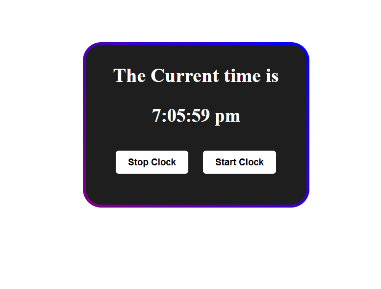

# 🕒 Digital Clock Web App

This is a simple digital clock web application built using **HTML**, **CSS**, and **JavaScript**. It displays the current time in real-time and provides **Start** and **Stop** buttons to control the clock display.

## ✨ Features

* Displays the current time (updated every second)
* Stylish and responsive dark-themed UI
* Start and Stop buttons to control the clock
* Built with pure JavaScript (no libraries or frameworks)

## 🚀 Getting Started

To run this project, simply clone the repository and open the `index.html` file in any modern web browser.

```bash
git clone https://github.com/Yugal-kosamshile/Watch-using-html-css-js
cd digital-clock
open index.html
```

## 📁 File Structure

* `index.html` — HTML structure

## 📸 Preview



## 🛠️ Future Improvements

* Add 12/24-hour toggle
* Include date and day of the week
* Add user customization (themes, fonts, etc.)
